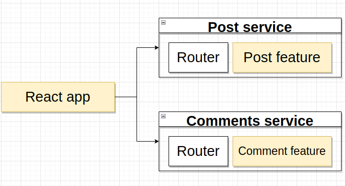
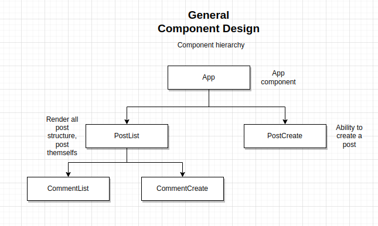
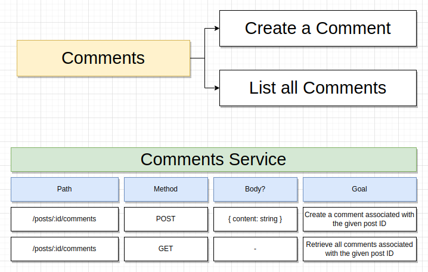
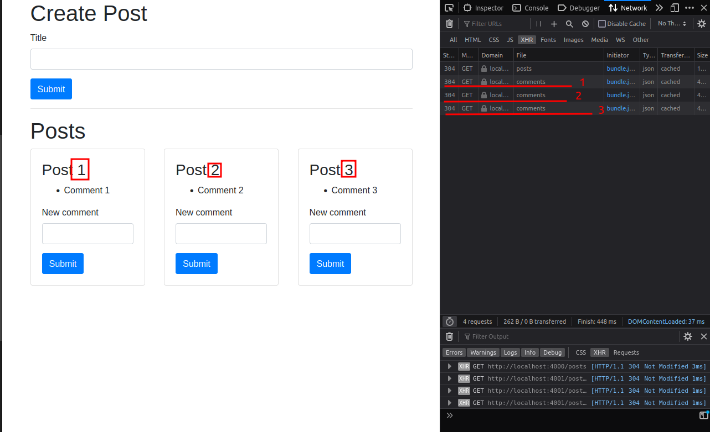

# Commit [22d0f26: Comment List feature]

At this point we have a functional application.

## App architecture

--------

## React Components

--------

## Current services architecture

For now, it was developed a Post site focused on two different services, comments and posts. As it can be seen bellow one of them is responsible for maintaining post creation and list and another one focused on comments.

--------

## Problem with approach seen above

For each post, the implementation that was done will need to make 1 request to the comments services, in order to fetch their contents. This is a problem of scalability,imagine milions of users making a handfull of requests to fetch comments for every single post in his screen.

--------------------------------

## The solution

As the course is focused on Microservices, the solution need to be microservices-based. So following the principles, the solution will be an async Communication shown bellow.

A Query service will be created to handle comments and post events that will be thrown on a event-bus. It will store the data emitted by other servives into a internal data structure.

The event-bus also will be created to focuse on recieving events from services and routing to other desired parties. For example, when a Post Service create a post, it throws an event inside the event bus and then this event will be directed query service.
